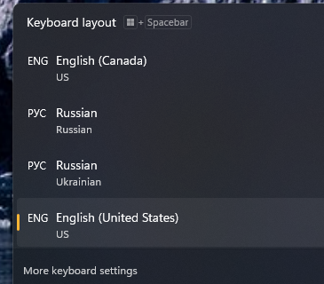
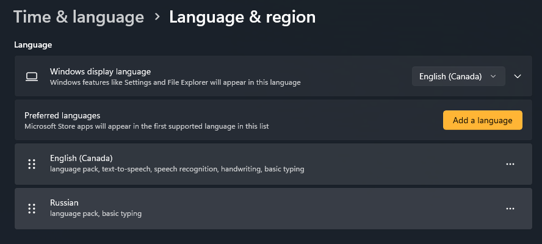

# Keyboard Layout Manager

A small Windows 11 tool for killing **ghost keyboard layouts** — layouts that show up in the Win+Space switcher, interfere with your typing, but are **invisible in Settings** and cannot be removed through any built-in UI.

If you've ever seen extra languages in your input switcher that Windows Settings insists aren't installed, this is the fix.

---

## The problem

Windows loads keyboard layouts from several places in the registry. The Settings UI only reads **some** of them. Layouts that load from places Settings ignores — "ghosts" — appear in Win+Space, get in the way, and have no "Remove" button anywhere:

| What you see | What Settings shows |
|---|---|
| 4 layouts in Win+Space (English Canada, Russian, Ukrainian…) | Only 2 declared, no way to delete the extras |

The only built-in fix is manual registry editing. This tool does it safely.

## What it does

- **Shows every layout actually loaded in your session** — not just what Settings admits to — and tells you exactly which registry key each one comes from.
- **Removes a layout from everywhere it hides** — including the `.DEFAULT` hive that Settings never touches. Ghosts first, clearly badged.
- **Resets to a known-good default** (English US + Russian out of the box) in one click.
- **Backs up before every change** — a timestamped `.reg` file you can double-click to undo.

## Screenshots

The problem this solves:

| Win+Space switcher | Windows Settings |
|---|---|
|  |  |

## Requirements

- **Windows 11** (or Windows 10)
- **.NET 9 Desktop Runtime** — [download from Microsoft](https://dotnet.microsoft.com/download/dotnet/9.0)

## Install

### Option A — run from source

```bash
git clone https://github.com/UncleHobbot/KeyboardManager.git
cd KeyboardManager
dotnet run --project src/KeyboardManager/KeyboardManager.csproj
```

### Option B — build a self-contained exe

```bash
dotnet publish src/KeyboardManager/KeyboardManager.csproj \
    -c Release \
    -r win-x64 \
    --self-contained \
    -o ./publish
```

Then run `publish\KeyboardManager.exe`. No .NET install needed on the target machine.

## How to use

### Remove a ghost layout

1. Launch the app. It lists every active layout, **ghosts first** (red badge).
2. Select the layout you want gone.
3. Click **Remove**.
4. A confirmation dialog shows exactly which registry values will be deleted. Review and confirm.
5. If the ghost lives under `.DEFAULT`, you'll get a **UAC prompt** — that's expected and only happens for that case.
6. **Sign out and back in** for `.DEFAULT`-sourced ghosts to fully clear from the switcher.

### Reset to a clean default

1. Click **Reset**.
2. Confirm the target set (English US + Russian by default).
3. Sign out and back in.

`.DEFAULT` (the logon screen) is never touched by Reset — that's a separate concern, handled by targeted removal.

### Back up manually

Click **Backup now** at any time to snapshot all four registry sources to a `.reg` file. Double-click it later to restore.

## Customising the reset default

Edit `KeyboardManager.config.json` (next to the exe):

```json
{
  "DefaultLayouts": [
    { "Id": "00000409", "Name": "English (United States) — US" },
    { "Id": "00000419", "Name": "Russian — Russian" }
  ]
}
```

- `Id` is the Windows keyboard layout identifier (8-digit hex). Common ones:
  - `00000409` — US English
  - `00000419` — Russian
  - `00000422` — Ukrainian
  - `00000809` — UK English
  - `0000040C` — French
  - `00000407` — German
- `Name` is just a label shown in the UI.
- Add or remove entries to match your preferred set. Restart the app to pick it up.

If the file is missing or malformed, the built-in default (US + Russian) is used.

## How it works (the short version)

Windows keeps your keyboard layouts in the registry under four keys:

| Key | What it does | Settings reads it? |
|---|---|---|
| `HKCU\Keyboard Layout\Preload` | Layouts loaded at your logon | ✅ Yes |
| `HKCU\Keyboard Layout\Substitutes` | Remaps one layout id to another | ✅ Yes |
| `HKU\.DEFAULT\Keyboard Layout\Preload` | Layouts for the logon/welcome screen | ❌ No |
| `HKU\.DEFAULT\Keyboard Layout\Substitutes` | Substitutes for the logon screen | ❌ No |

The last two are where ghosts come from. A layout can sit in `.DEFAULT\Preload` and show up in your switcher, but Settings has no idea it's there — so there's no way to delete it through the UI. This tool reads all four keys, resolves the substitute mappings (e.g. `d0010419 → 00000422` is really Ukrainian hiding behind a Russian id), and removes what you don't want.

For the full design — including why elevation works the way it does — see [`docs/adr/0001-elevate-on-demand.md`](./docs/adr/0001-elevate-on-demand.md).

## Safety

- **Every destructive operation takes a `.reg` backup first**, written to a `backups\` folder next to the app. Double-click any backup to undo.
- **Nothing is silently overwritten** — a confirmation dialog lists the exact values about to change.
- **HKCU edits need no admin rights.** Only edits to `.DEFAULT` trigger a UAC prompt, and only then.
- **Reset never touches `.DEFAULT`** — it only cleans your user hive.

## Troubleshooting

**The ghost is still in the switcher after I removed it.**
Sign out and back in. Layouts loaded from `.DEFAULT` don't disappear from a running session until you re-logon — that's a Windows limitation, not a bug.

**I get a UAC prompt.**
That only happens when removing a ghost that lives under `.DEFAULT`, which requires admin rights to write. The rest of the app runs without elevation.

**Reset didn't change anything.**
Make sure you signed out and back in. The registry was written, but the running session may not have picked it up.

**I want to undo a change.**
Go to the `backups\` folder next to the exe, find the timestamped `.reg` file from before your change, and double-click it.

## License

MIT — see repository for details.

## Contributing

This is a personal tool, shared in case it's useful. Bug reports and suggestions are welcome via [issues](https://github.com/UncleHobbot/KeyboardManager/issues).
